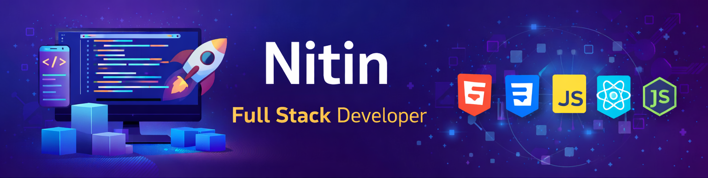

<!-- ===================== BANNER ===================== -->

  
  

<!-- ===================== INTRO ===================== -->
<h1 align="center">Hi 👋, I'm  Kasturi Nitin Kumar</h1>
<h3 align="center">Full Stack Developer | Computer Science Student</h3>

  ✨ Learning full-stack development  
  📚 Exploring Node.js & Backend Systems  
  🎯 Interested in real-world software projects

<!-- ===================== ABOUT ME ===================== -->
<h2 align="left">About Me</h2>

🚀 Final-year Computer Science student  
💻 Actively working on MERN & backend projects  
🧠 Passionate about building scalable, real-world applications

<!-- ===================== TECH STACK ===================== -->
<h2 align="left">Tech Stack & Tools</h2>

<!-- Frontend -->
<h4 align="left">Frontend</h4>

  
  
  
  
  
  
  
  
  

 

<!-- Backend -->
<h4 align="left">Backend</h4>

  
  
  
  
  

🔹 RESTful APIs &nbsp;&nbsp; 🔹 JWT Authentication &nbsp;&nbsp; 🔹 MVC Architecture

 

<!-- Databases -->
<h4 align="left">Databases</h4>

  
  
  
  
  

 

<!-- Tools -->
<h4 align="left">Tools</h4>

  
  
  
  
  
  
  

 

<!-- Deployment -->
<h4 align="left">Deployment & Version Control</h4>

  
  
  
  
  
  
  

<!-- ===================== CONTACT ===================== -->
<h2 align="left">How to Reach Me</h2>

  
  

  
  

  
  

  

<!-- ===================== STATS ===================== -->
<!-- <h2 align="left">GitHub Stats</h2>

  

  

 -->

<!-- ===================== LEARNING ===================== -->
<h2 align="left">Currently Learning</h2>

<ul>
  <li>Advanced Node.js & Backend Architecture</li>
  <li>System Design Fundamentals</li>
  <li>AI & Machine Learning Basics</li>
</ul>

<!-- ===================== COLLAB ===================== -->
<h2 align="left">Open to Collaborate</h2>

🤝 Open to open-source and real-world project collaborations  
📬 Feel free to reach out for teamwork and learning opportunities

